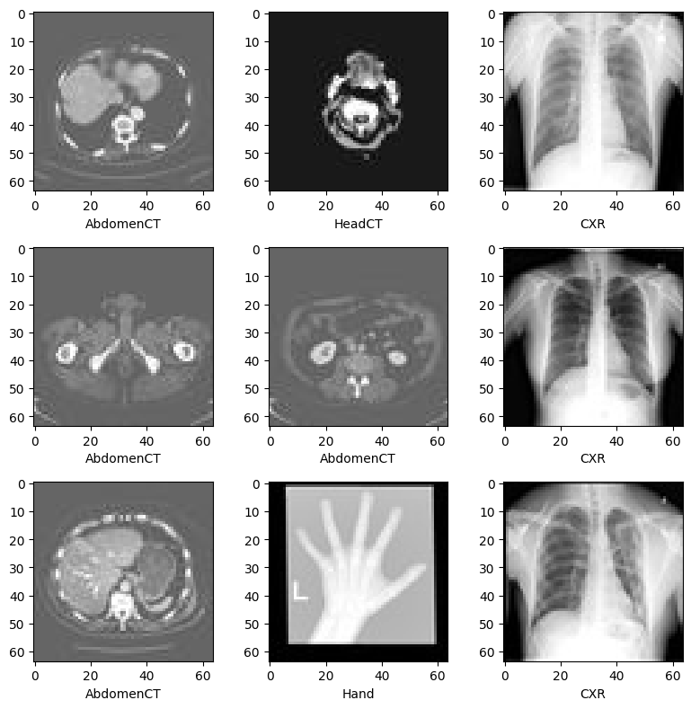
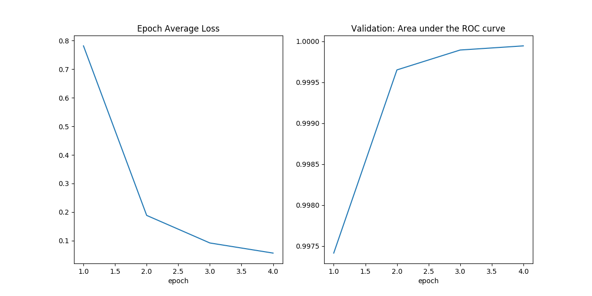
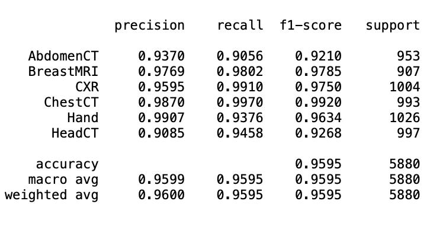

# MedNIST Workflow

<!-- photo -->


## Introduction

The MedNIST dataset is a collection of medical images from various modalities, including CT scans, X-rays, and MRI. It was created to facilitate research and educational purposes, providing a benchmark for image classification tasks in medical imaging. The dataset includes images categorized into six distinct classes:

- **AbdomenCT**
- **BreastMRI**
- **CXR** (Chest X-rays)
- **ChestCT**
- **Hand**
- **HeadCT**

I chose this project because medical imaging plays a crucial role in diagnosing and treating diseases. Leveraging machine learning to analyze medical images can significantly improve diagnostic accuracy and efficiency. The MedNIST dataset is an excellent starting point for exploring deep learning applications in healthcare, as it is well-organized and provides a diverse range of medical images.

This project implements two distinct workflows:

1. **Training Workflow**: The process of training a DenseNet121 model on the MedNIST dataset.
2. **Inference Workflow**: The process of using the trained model to classify unseen images.

---

## Steps to Reproduce

### 1. Prerequisites

1. **Install Nextflow**:

- Ensure you have Nextflow installed. If not, you can install it using the following command:
  ```bash
  curl -s https://get.nextflow.io | bash
  chmod +x nextflow
  sudo mv nextflow /usr/local/bin
  ```
- Verify Installation:

  ```bash
  nextflow -v
  ```

2. **Install Docker**:

   - Docker is required for this project. If you don’t have Docker installed, follow the instructions [here](https://docs.docker.com/get-docker/).

- To ensure Docker is installed correctly, run:
  ```bash
  docker --version
  ```

3. **Dependencies**:

   - Each workflow includes a `requirements.txt` file and a `Dockerfile` that lists all dependencies. However, the main ones are:
     - **Python 3.8.6**
     - **monai==1.3.2**
     - **scikit-learn==1.2.2**
     - **numpy==1.23.1**
     - **torch==1.13.1**
     - **scipy==1.9.0**
     - **Pillow==9.2.0**
     - **pandas==1.5.0**
     - **einops==0.8.0**
     - **transformers==4.46.3**
     - **matplotlib==3.1.3**

---

## Running the Project

### Running the First Workflow: Training

1. **Navigate to the `1.Model` directory**:

     ```bash
     cd 1.Model
     ```

2. **Verify Nextflow Installation**:
   - Verify that Nextflow is installed by running:
     ```bash
     nextflow -v
     ```
   - If Nextflow is not installed, follow the steps in the prerequisites section to install it.

3. **Build the Docker Image**:

   - Create the Docker image for the training workflow using the following command:
     ```bash
     docker build -t mednist_training:latest .
     ```

4. **Run Nextflow**:

   - Execute the training workflow using Nextflow:
     ```bash
     nextflow run main.nf --with-docker
     ```

5. **Output of the Training Workflow**:

   - The output of this workflow is saved in the following directories:

     - `./results/train`
     - `./results/test`

   - **Training Metrics Plot**:

     - A file named `training_plots.png` is generated, containing two plots:
       1. **Epoch Average Loss**:
          - This plot shows the average loss per epoch, illustrating how the model’s training loss decreases over time, indicating improved learning.
       2. **Validation Area Under the ROC Curve**:
          - This plot shows the ROC AUC for the validation dataset per epoch, demonstrating how well the model distinguishes between classes during validation.

    

   - **Test Metrics Plot**:

     The output of the testing workflow includes a file named `classification_report.txt`.

     **Classification Report**:

     The report contains precision, recall, F1-score, and support for each class. For example:
    
    

     **Explanation of Metrics**:

     - **Precision**: The ratio of true positives to the sum of true and false positives for each class.
     - **Recall**: The ratio of true positives to the sum of true positives and false negatives for each class.
     - **F1-Score**: The harmonic mean of precision and recall, providing a single metric for classification performance.
     - **Support**: The number of true instances for each class.

   - **File Structure**:

     - The training workflow outputs visual metrics for performance tracking and detailed evaluation.


### Running the Second Workflow: Inference

1.  **Navigate to the `2.Inference` directory**:

     ```bash
     cd 2.Inference
     ```

2. **Verify Nextflow Installation**:

   - Verify that Nextflow is installed by running:
     ```bash
     nextflow -v
     ```
   - If Nextflow is not installed, follow the steps in the prerequisites section to install it.

3. **Build the Docker Image**:

   - Create the Docker image for the inference workflow using the following command:
     ```bash
     docker build -t mednist_inference:latest .
     ```

4. **Run Nextflow**:

   - Execute the inference workflow using Nextflow:
     ```bash
     nextflow run main.nf --with-docker
     ```


5. **Output of the Inference Workflow**:

   - The output of this workflow is a file named `test_predictions.csv`, which contains the classifications for the images in the `./test_mednist` folder.

   - **File Structure**:

     - Each row in the `test_predictions.csv` file contains the image name and its predicted class. This structured format allows for easy analysis and validation of the model’s predictions.


    **Explanation**:
    - The Docker image encapsulates all dependencies for inference.
    - Nextflow provides an easy-to-use interface to run the inference pipeline consistently across environments.
---


